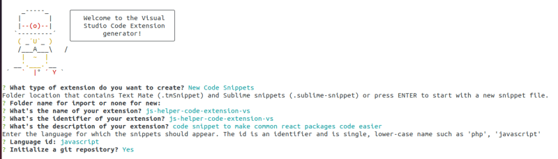

# Building my first VS Code Extension

_I recently built my first VS Code extension and published it. It consists of basic code snippets that include commonly used React packages._

**What are Code Snippets?**  
Code snippets are reusable blocks of code that can be inserted into your code editor with a single command or 
keyboard shortcut. Snippets can be used to save time by automating common tasks, such as creating boilerplate code 
or filling in repetitive code patterns. Snippets can also improve code quality by ensuring that code adheres to best 
practices or standards.


**Building a Code Snippets Extension**

1.  Install the yo and generator-code packages using the following command:
```
npm install -g yo generator-code
```
2.  Create a new code snippets extension using the following command:
```
yo code
```
3.  Follow the prompts to configure your extension. When prompted, select "New Code Snippets" as the project type.



4. The VS Code snippet editor will open. Here, you can define your code snippets using a JSON format.
5. Define your code snippets in the 'prefix', 'body', and 'description' properties within the 'snippets.code-snippets' file in the 'snippets' folder
6. Test your code snippets extension using the VS Code debugger.

**Publishing VS Code extension**

1.  Install vsce with  `npm install -g vsce`
2.  Create an account in  [VS Code MarketPlace](https://marketplace.visualstudio.com/VSCode)  and create an organisation
3.  Add the publisher name in package.json file

```
  "publisher": "publisherName",

```

1.  Run the command

```
vsce package

```

It will create a file in .vsix.  
If it warns for empty repository the add  

```
"repository": {
    "private": true
  },

```

and if it ask for license then add a LICENSE.md file

1.  Click on "+ New Extension" and add .vsix file.
    
2.  It will take some time for verifications and finally available in marketplace
    

[**Extension in VS Code Marketplace**](https://marketplace.visualstudio.com/items?itemName=AmitKRout.js-helper-code-extension-vs)

**Conclusion**

Building a code snippets extension on VS Code is a great way to share your code snippets with others and improve your own productivity. With a few simple steps, you can create a custom extension that automates common tasks and adheres to best practices.

Hope you use this extension, like it, and review it.

**Happy Coding!**