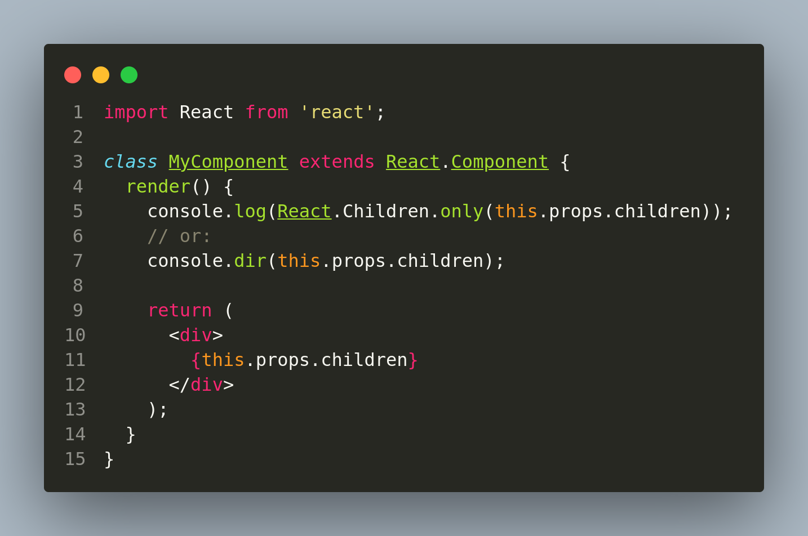

# Why there can be multiple console output with one console.log() in ReactJS ?

In ReactJS, a single  `console.log()`  statement can produce multiple outputs in the console because React uses a virtual DOM (Document Object Model) to render and update the user interface. When a  `console.log()`  statement is executed, it may output multiple elements from the virtual DOM, depending on how the React components are structured and how the code is written.

For example, if a  `console.log()`  statement is called within a React component that contains multiple child components, each of those child components may be output to the console individually. Additionally, if the  `console.log ()`  statement is called within a React component that updates over time, it may output multiple versions of the component as it changes.

In order to avoid this behavior and only output a single element from the virtual DOM, you can use the  `React.Children`  utility to extract the specific child component that you want to log, or you can use the  `console.dir()`  method, which outputs a tree-like representation of the DOM element, rather than individual elements. For example:

In this code, the  `console.log()`  statement will only output a single child element from the  `this.props.children`  prop, rather than multiple elements. This can help to make your debug output more readable and easier to understand.

**Happy Coding!**